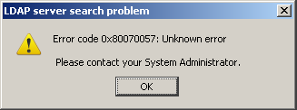

Another nice one from Thunderbird:

{{}}

The hex number is a nice touch: provide the illusion of being specific and helpful while not actually doing so. The suggestion to contact a system administrator is a good one, as misery loves company.
